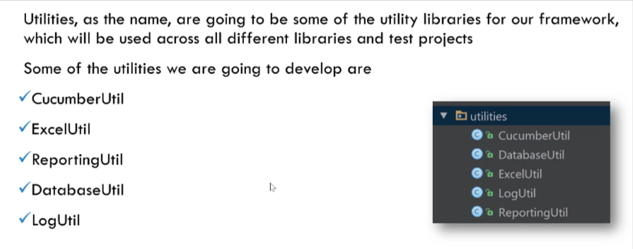

# Designing automation framework

## INTRODUCTION 

Any software development must start with a good design, I mean GOOD DESIGN  

For good design, there must be some principles

## Principles of Good Design

Reusability
Scalability
Maintainability
Understandability
Workability

is there anything other than principles?
Yes !!!

* Generic to Technology
### Extendable ( Don't confuse with Scalable)
Your framework should not be restricted just with one type of testing technology, say  
UI testing, but it should extendable to support various different testing technologies
and types like
* Web service testing
* Integration testing
* Unit testing

### Wrappable ( Don't confuse with extensible methods)

Since we are going to write selenium code, our framework should have wrappable  
selenium elements, meaning your framework should not depends on any of the  
selenium version which makes your framework have **your own controls**

Finally or goal of this course is to make the framework development and design as simpler as possible

But there is a catch, as once a great man said

Everything should be made as simple as possible, but not simpler

So considering principles and generic framework design in mind, our framework is going to look something like 

Initial draft design

## Framework Overview

### Utilities

### Base

### Controls

Writing our own selenium controls

### Configurations

### Test Layer Structure

## Framework Design Prerequisite
Language Knowledge 
Java Advanced concepts like - 
1. Generics
2. Writing custom attributes
3. Lamda Expressions

Additional Knowledge - 
Basic understanding of OOP concepts  
Basic understanding on any design pattern  
Basic understanding on MVC (Model view controller)  
**Understanding capability of internal workflow of Selenium Library**

Any tools - 
YES
* Cucumber
* Cucumber-picocontainer
* TestNG framework
* Junit framework
* Maven
* Jenkins

### Starting our framework design in Intellij