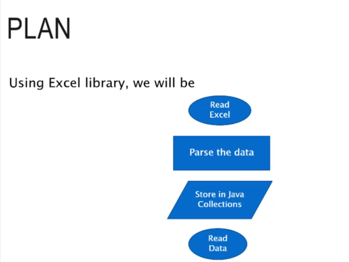
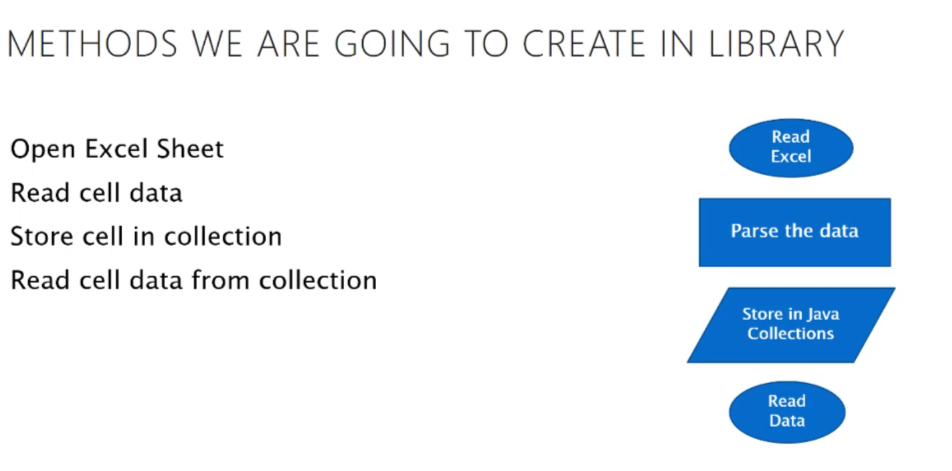

# Utilities

Utilities as the name, are the libraries of code which act as a reusable code for the whole framework

These Utilities act as a shared libraries for all the code within our framework and project which refers them

THE FIRST 90 PERCENT OF THE CODE ACCOUNTS
FOR THE FIRST 90 PERCENT OF THE DEVELOPMENT
TIME...THE REMAINING 10 PERCENT OF THE CODE
ACCOUNTS FOR THE OTHER 90 PERCENT OF THE
DEVELOPMENT TIME.

Plan - 
* CucumberUtil
* DatabaseUtil
* ExcelUtil
* LogUtil
* ReportingUtil

## Developing Excel Utility
EXCEL HELPER ACT AS LIBRARY TO READ
DATA FROM EXCEL SHEET, PARSE DATA
AND STORE DATA IN-MEMORY
COLLECTIONS

### JXL

Java Excel API is a mature, open source java API enabling developers
to read, write, and modifiy Excel spreadsheets dynamically. Now java
developers can read Excel spreadsheets, modify them with a
convenient and simple API, and write the changes to any output
stream
We can add the reference of JXL from Maven Repo

### In-memory collection

We will be storing all the Excel data read from excel sheet into
HashTable of Java, so that we don't end up with lot of read/write IO
operation while executing automation code. (this will end up in slow
execution of automation script)

## Log Utility

We are going to enable our automation framework to have a logging system in  
place, so that we can track record of what's happening behind the scene within our  
framework.
There are two ways we can keep our logging to work
1. Outputting our log to an external datasource/file
2. Outputting our log to console

These logs are especially handy if we want to audit our log in future or if we require  
the file to be handed over to some team which don't have direct access to our system  
by any means

A Logger Utility in a Selenium framework is a helper class that handles logging test execution steps, errors, info, warnings, and debug messages to the console or a file. It's essential for debugging, traceability, and analyzing test runs — especially in large automation projects.

### Why Use LoggerUtility?

* Helps track test execution flow  
* Makes debugging easier when tests fail  
* Provides clean reports/log files  
* Centralizes logging configuration (no need to add System.out.println() everywhere)

### Common Logging Libraries:
* Java: log4j, SLF4J, java.util.logging
* Python: logging module
* JavaScript: winston, log4js